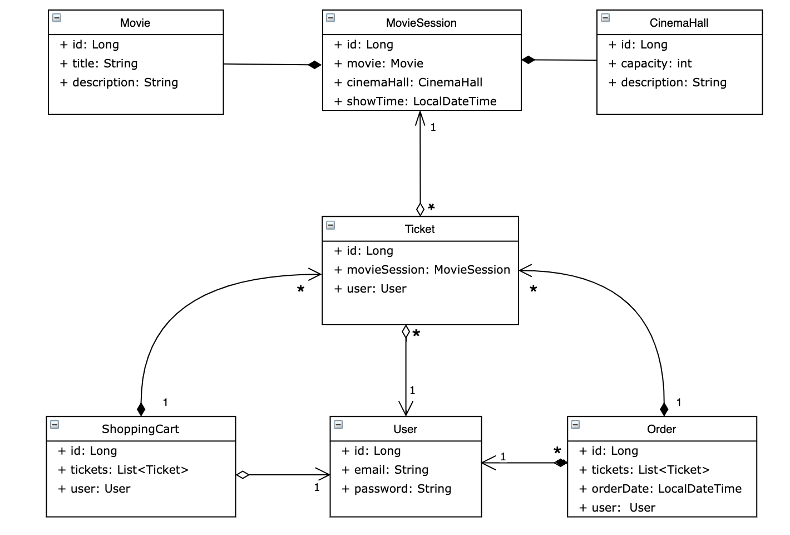

#  Cinema App 

## Description
A simple implementation of a real cinema service for reserving tickets with authentication
___

## Features
When you open application website you can login or register
### If you login as user with role USER, you can:
- See all information of movies, cinema halls and movies sessions
- Add a ticket to the shopping cart
- Create order
- See order history
- Logout
### If you login as user with role ADMIN, you can:
- See all information of movies, cinema halls and movies sessions
- Create, modify and delete cinema-hall, movies, and movie sessions from the database
- Get info about user by email
- Logout
___

## Project structure
Project is built on a three-tier architecture:
1. Presentation layer (controllers);
2. Application layer (service);
3. Data access layer (DAO)
### Table relation

### Configured role access to endpoints for ADMIN and USER 
- POST: /register - all
- GET: /cinema-halls - user/admin
- POST: /cinema-halls - admin
- GET: /movies - user/admin
- POST: /movies - admin
- GET: /movie-sessions/available - user/admin
- POST: /movie-sessions - admin
- PUT: /movie-sessions/{id} - admin
- DELETE: /movie-sessions/{id} - admin
- GET: /users/by-email - admin
- PUT: /shopping-carts/movie-sessions - user
- GET: /shopping-carts/by-user - user
- GET: /orders - user
- POST: /orders/complete - user
___

## Technologies
- Spring (Core, Web, Security)
- Hibernate
- Apache Tomcat (v. 9.0.50)
- MySql

___

## Run Project
### Tools to run project:
- Intellij IDEA Ultimate
- MySql
- Apache Tomcat
1. Clone this project
2. Add new configuration TomCat Local server
3. Create DB in MySQL Workbench
4. Configure your properties in db.properties. 
#### After running the application you can login:
- username admin@i.ua with password admin123 if you want login as admin
- username user@i.ua with password user123 if you want login as user
